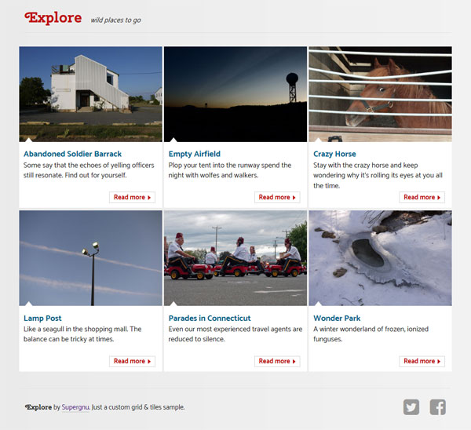

# Grid & Tiles Sample

## Task

Please build a responsive grid of tiles which each contain a thumbnail image, linked heading, body copy and CTA.
 
This exercise is designed to be brief, yet open-ended. You should take just enough time to fully express yourself. 
 
There is no right or wrong way to approach this. We see this as an opportunity for you to demonstrate your coding prowess and creative interpretation of this assignment. Ideally, we'd like to see this done without using a CSS framework.
 
Free free to provide this as a codepen, publish it to github, or your personal site.

## Solution
A minimal design that suggests some sort of travel site. As the browser window grows, the tile copy moves from bottom to right and back to the bottom to retain a good image/text ratio. A little button animation is added on tile hover after the 1st breakpoint.

## Usage

* `npm install`
* `gulp` starts watch, livereload & server.
  Should open browser window automatically. Otherwise: go to [http://localhost:8000/](http://localhost:8000/)

## Notes

* Tested in Firefox and Chrome (windows), Android Chrome and iOS 6. The view after the first breakpoint does not make IE happy.
* Grid is placed in _mixins, tiles in _home.scss
* Build/deploy task is not included.
* Fonts: Cherry Swash and Catamaran from Google fonts, customized icon font from IcoMoon for Twitter and Facebook logos.
* Photos: Are all mine. Please don't reuse without my knowledge.